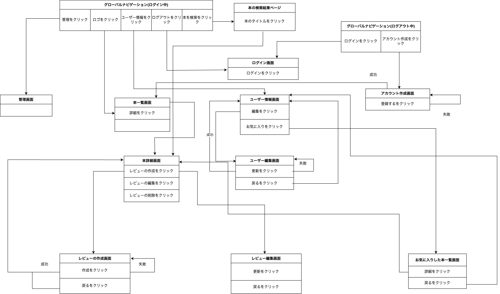

# README

## 開発言語

- Ruby 3.0.1
- Rails 6.1.6

---

## 就職 Term の技術

- devise
- お気に入り機能

---

## カリキュラム外の技術

- 楽天 API

---

## 実行手順

```
$ git@github.com:gaia0683/unhappy_books-original_app.git
$ cd unhappy_books-original_app
$ bundle install
$ rails db:create && rails db:migrate $ rails s
```

---

## カタログ設計

https://docs.google.com/spreadsheets/d/1tJM-9ibSDB3m7unyGWLAdz3qc2n0YXy4lsvVECp4f8k/edit#gid=157013831

---

## ワイヤーフレーム

https://www.figma.com/file/dcEUHR6fqd9UDngU6BpFyi/%E7%84%A1%E9%A1%8C?node-id=5%3A81

---

## ER 図


---

## 画面遷移図



---
